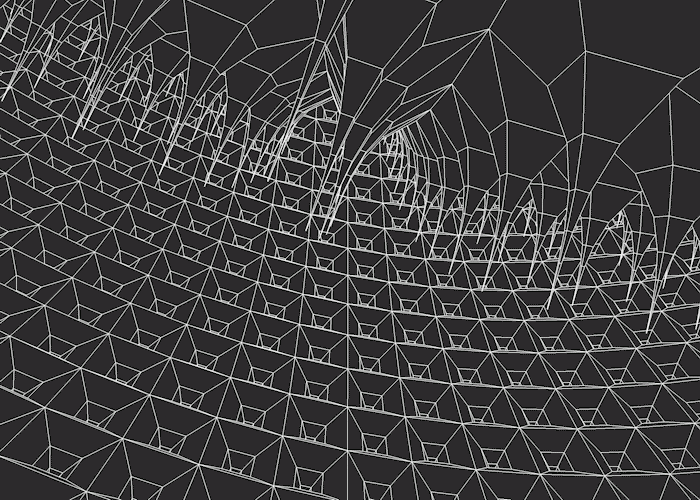
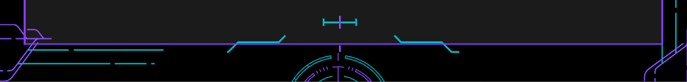

  <h1><i>🤩Hey there! It's me, Chinmaya!🤩</i></h1>
  
  
AWS Certified Cloud Practitioner and an ML Enthusiast

 

  <h3><i>🎧 What I specialize in:</i></h3>
  <ol>
    <li>🧠 Making Machine Learning/Deep Learning Models and deploying them in Real World Applications.</li>
    <li>😡 Brute Force algorithm. Can't get enough of them. Bad habit. Working on optimising my thoughts.</li>
    <li>🗺️ Hashmaps were one of the best things to happen to humanity.</li>
    <li>🛰️ Research about satellites and their control systems. Apparently its very fun.</li>
    <li>📚 Full stack has become a necessity. Man</li>
  </ol>

 

 

  <h3> 💫 Some trance stuff to make profile look cool</h3>
  

<h6>Please just pretend its some CAD stuff.</h6>
 

 

<h3>🎧 What I am hearing currrently - Review my taste in music!</3> 
 
  

 

 
<a><h2>📊Github Stats</h2></a>

Not the best, but we have to start somewhere, am I right?😭

    
    
  

 

  <h3>🏆 Trophy Showcase</h3>
  
  <h3>Skills</h3>
  
⭐⭐⭐⭐⭐

  
⭐⭐⭐⭐⭐

  
⭐⭐⭐⭐⭐

  
⭐⭐⭐⭐

  
⭐⭐⭐⭐

  
⭐⭐⭐⭐

  
⭐⭐⭐

  
⭐⭐⭐

  
⭐⭐

 

 

  <h3>👋😊Thank you for visiting! Please visit again!🙂</h3>

 

 

